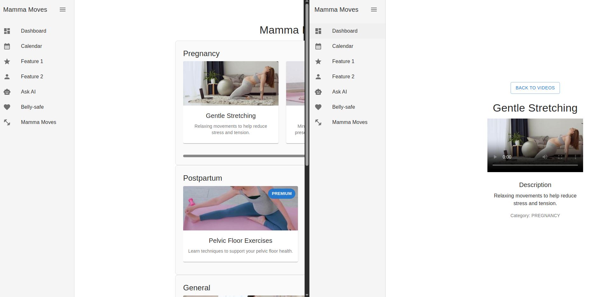

# mamma-moves

## Description
A web application designed to help users track and manage their fitness journey with Mamma Moves. The platform offers a comprehensive library of exercise videos that users can easily search and filter. Additionally, users have the option to unlock premium content through our subscription service, giving them access to exclusive workout videos and features.

## Cursor document of requests
- [Cursor doc](https://www.notion.so/Mamma-Moves-1dbdc030bde98079aaf9f6d482d59d60)

## Links
- [Video Explanation](https://drive.google.com/file/d/1wY5AZjgZ1e2J8JKA5CnGnBz-ylxdcwXc/view?usp=sharing)

## Project Status
Currently, the project has the following setup completed:
- Basic project structure with frontend and backend separation
- Docker configuration for development environment
- Database (PostgreSQL) configuration
- MinIO object storage setup
- Development environment configuration
- Basic npm scripts for development and production
- Video module implementation
- Storage module implementation
- Seed data setup
- Access level management
- Admin functionality



## TODO List
- [ ] Implement user authentication and authorization
- [ ] Add CI/CD pipeline
- [ ] Implement error handling
- [ ] Add logging system
- [ ] Set up monitoring and analytics
- [ ] Add performance optimizations

## Prerequisites
- Node.js (v14 or higher recommended)
- npm or yarn
- Git
- Docker and Docker Compose (for containerized setup)

## Installation

### Backend Setup

1. Clone the repository:
```bash
git clone https://github.com/yourusername/mamma-moves.git
cd mamma-moves/backend
```

2. Install dependencies:
```bash
npm install
```

3. Create a `.env` file and configure your environment variables:
```bash
cp .env.example .env
```

4. Start the required services using Docker Compose:
```bash
docker-compose up -d
```
This will start:
- PostgreSQL database on port 5432
- MinIO object storage on ports 9000 (API) and 9001 (Console)

You can access:
- MinIO Console at `http://localhost:9001`
- MinIO API at `http://localhost:9000`

Default credentials:
- PostgreSQL: 
  - User: postgres
  - Password: postgres
  - Database: mamma_moves
- MinIO:
  - User: minioadmin
  - Password: minioadmin

5. Start the backend server:
```bash
npm run start:dev
```

The backend server should now be running on `http://localhost:YOUR_PORT`

### Frontend Setup
1. Navigate to the frontend directory:
```bash
cd frontend
```

2. Install dependencies:
```bash
npm install
```

3. Create a `.env` file and configure your environment variables:
```bash
cp .env.example .env
```

4. Start the frontend development server:
```bash
npm run dev
```

The frontend application should now be running on `http://localhost:3000`

## Available Scripts

### Backend
- `npm run dev` - Start the development server
- `npm run build` - Build the application
- `npm run start` - Start the production server
- `npm run test` - Run tests

### Frontend
- `npm run dev` - Start the development server
- `npm run build` - Build the application
- `npm run start` - Start the production server
- `npm run test` - Run tests

## Contributing
Please read [CONTRIBUTING.md](CONTRIBUTING.md) for details on our code of conduct and the process for submitting pull requests.

## License
This project is licensed under the MIT License - see the [LICENSE](LICENSE) file for details